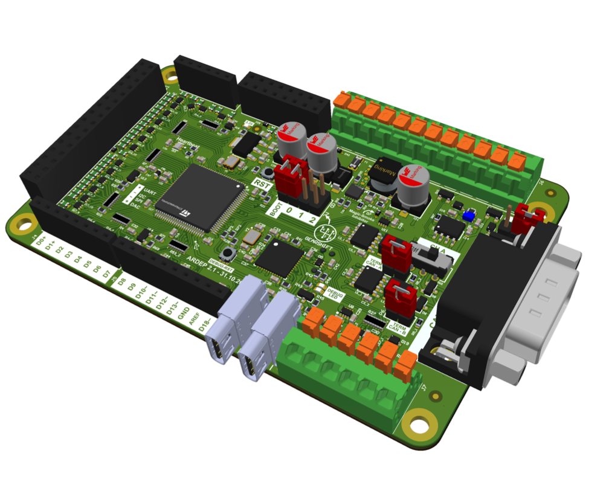

ARDEP - Automotive Rapid Development Platform
#############################################

ARDEP (**A**\ utomotive **R**\ apid **DE**\ velopment **P**\ latform) is an open-source hardware and software platform 
that simplifies automotive development. It combines a feature-rich development board with a robust 
Zephyr-based software framework, enabling you to build and deploy automotive applications quickly.

Whether you're prototyping a new automotive device or experimenting with diagnostics,
ARDEP provides the tools and infrastructure you need.

Waypoints
=========

* **Documentation**
   * `Documentation <https://mercedes-benz.github.io/ardep/>`_
   * `Getting Started Guide <https://mercedes-benz.github.io/ardep/getting_started/index.html>`_

* **Hardware**
   * `Hardware documentation <https://mercedes-benz.github.io/ardep/boards/mercedes/ardep/doc/index.html>`_
   * `PowerIO Shield documentation <https://mercedes-benz.github.io/ardep/boards/shields/power_io_shield/doc/index.html>`_
   * `Hardware files <hardware/>`_

* **Software**
   * `UDS Library documentation <https://mercedes-benz.github.io/ardep/lib/uds/README.html>`_
   * `Sample documentation <https://mercedes-benz.github.io/ardep/samples/>`_
   * `Sample sources <samples/>`_

* **Project**
   * `Contributing guidelines <CONTRIBUTING.md>`_
   * `License <LICENSE>`_

At a Glance
===========

* **Complete hardware solution** - Ready-to-use development board with CAN, LIN and other common communication interfaces
* **PowerIO Shield** - Extended Power capabilities for 6 Outputs and 6 Inputs up to 48V and 3A per channel
* **Automotive-ready software** - Built-in UDS diagnostics (ISO 14229) and DFU firmware update support
* **Proven foundation** - Based on the reliable Zephyr RTOS with a large ecosystem
* **Fast prototyping** - Develop and iterate quickly without worrying about hardware integration

Key Features
============

**Hardware**

* **Integrated development board** - Open-source design with everything you need built-in
* **Automotive communication** - Onboard CAN and LIN transceivers (no external components needed)
* **Debugger & programmer onboard** - Integrated debugger and programmer with UART connection
* **PowerIO Shield** - Extended power capabilities with six 3A high-side switches at up to 48V
* **Arduino headers** - Compatible with a wide range of Arduino shields and accessories

**Software & Framework**

* **Zephyr RTOS based** - Built on the reliable, widely-adopted open-source Zephyr RTOS
* **Automotive diagnostics** - Built-in UDS support (ISO 14229) for professional diagnostics
* **Firmware updates** - Integrated DFU (Device Firmware Update) over UDS
* **Modular architecture** - Clean separation of concerns, designed for long-term maintainability
* **Rich connectivity** - CAN, LIN, SPI, I2C, UART and more with unified and easy-to-use APIs

Getting Started
===============

Ready to dive in? Start with the `Getting Started Guide <https://mercedes-benz.github.io/ardep/getting_started/index.html>`_ 
for a comprehensive step-by-step introduction. You'll find sample projects and examples to help you get up and running quickly.

For detailed information on using ARDEP, API references, and troubleshooting, refer to the 
`complete documentation <https://mercedes-benz.github.io/ardep/>`_.

Contributing
============

Contributions are welcome and appreciated.
Please see `CONTRIBUTING.md <CONTRIBUTING.md>`_ for guidelines and further
information.

License
=======

Copyright Mercedes-Benz AG

This project is licensed under the `Apache 2.0 License <LICENSE>`_.
