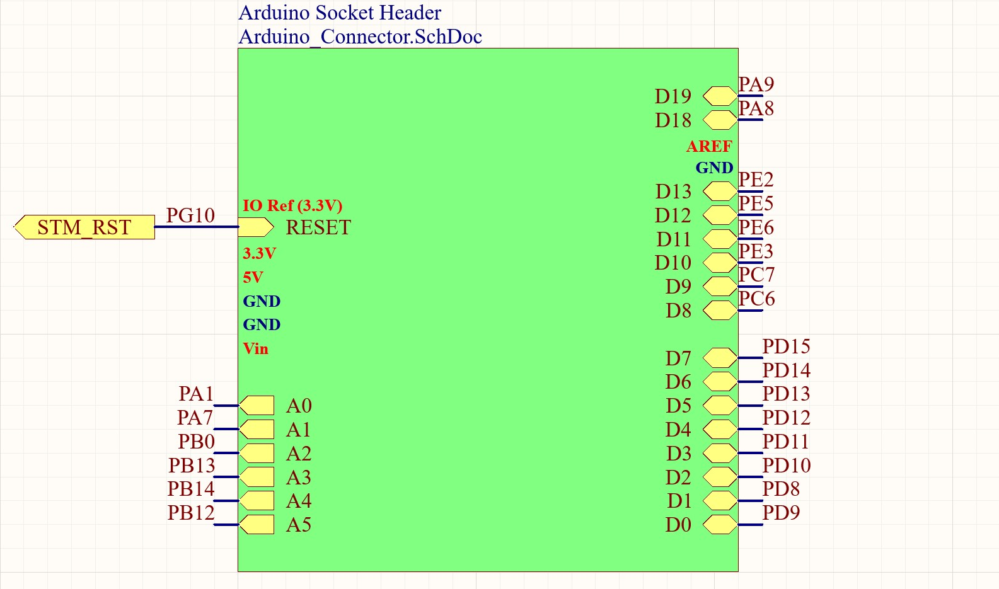
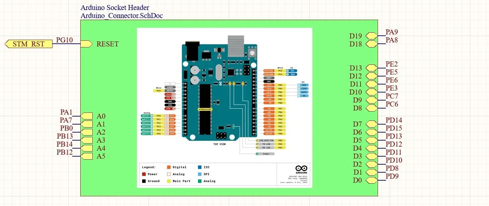
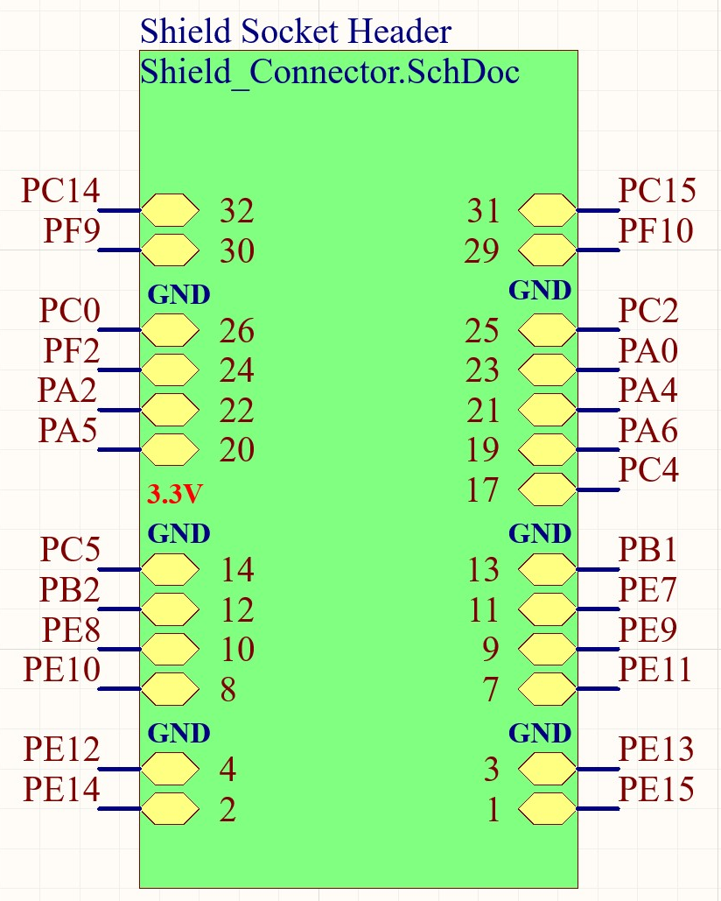
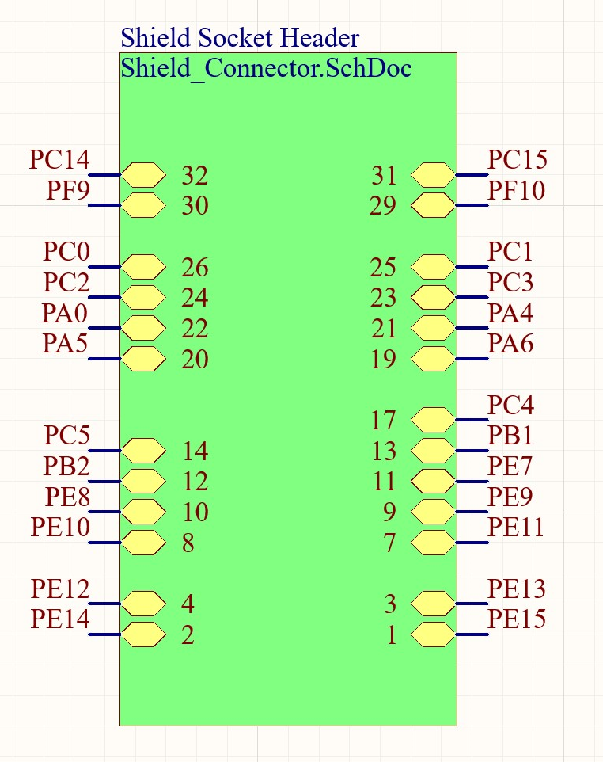
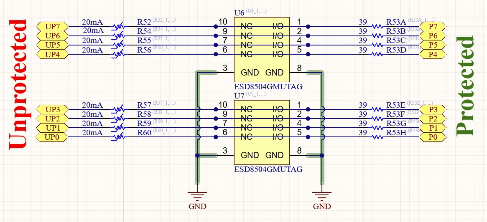

.. _board_gpio:

GPIO
####

.. contents::
   :local:
   :depth: 2

The mainboard IOs are 3.3 V or 5V tolerant.
the 5V tolerant IOs show an extra “x“ as an indicator on the PCB silkscreen.

I/O Pinout
==========

The GPIOs can be accessed via an Arduino-compatible pin header arrangement and an additional (non-Arduino-compatible) 32-pin header.

Arduino Header
==============

    Arduino Pinout starting from rev 0.2

    Arduino Pinout up to rev 0.1
    
32-Pin Header
=============

    32-Pin connector starting from rev 0.2

    32-Pin connector up to rev 0.1

I/O protection
==============

All GPIOs are Protected from ESD and a catastrophic High Voltage event.

Implementation
--------------

Every IO is equipped with the protection circuit illustrated in the figure below.
It consists of a self-resettable 20mA poly fuse, a snap-back ESD diode, and an additional series resistor.

The snap-back diode is a special kind of ESD Diode, which triggers, once a certain threshold voltage (in this case ~6V) is reached.
It then proceeds to clamp the input voltage to a rather low level of ~1.2V.
This is crucial in case of a continuous overvoltage event (e.g. accidental connection of 12V or 24V).
The low clamping voltage limits the dissipated power within the ESD diode which protects the diode and leads to a faster triggering of the polyfuse.

In case of a continuous overvoltage of below ~8V at the connector, it cannot be guaranteed, that the snapback diode triggers.
Even though it will start to clamp the voltage, an out-of-spec overvoltage may occur at the µC IO Pin and the IC's internal ESD Protection will engage.
To mitigate potential damage to the µC the 39 Ohm series resistor will limit the current into the µC’s ESD protection circuit.

This rather robust protection circuit results in a GPIO output resistance of up to 109 Ohm.
This will be the main bandwidth limiting factor of the digital IOs and could be adjusted in a tradeoff between IO-speed and IO-robustness.

    TODO CAPTION

UART
====

The two UART channels are treated like all the other GPIOs.
They are routed to a separate spring contact terminal which can therefore be used for UART, or four general-purpose IOs.

Analog I/O
==========

Analog IOs are not separately treated on the mainboard.
Instead, all µC GPIOs with analog functions can be software-defined and used accordingly.