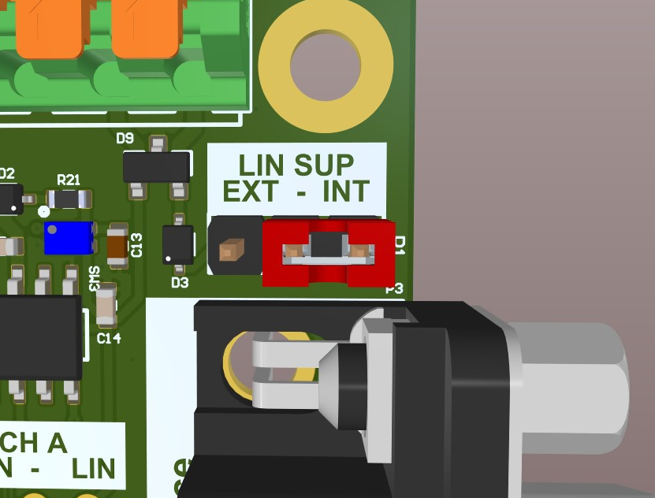

.. _board_power_scheme:

Power Scheme
###############

.. contents::
   :local:
   :depth: 2

The Mainboard can be supplied via USB or one of 4 electrically connected VIN Pins.
In addition, the user can decide to supply the LIN bus via the Mainboard's internal 5V rail or an external spring contact. 

The Internally generated 5V and 3.3V supply rails are accessible via the Mainboard’s pin headers and the spring contact headers.

For detailed pinout information please refer to the :ref:`board_pinout`.

Voltage Inputs
===============

There are two ways of supplying the Mainboard with power.
It can be supplied via USB or the input voltage terminals.
The Mainboard features a power multiplexer that automatically selects between the two supply methods while prioritizing the input voltage terminals. 

Independent of the supply method, a 5V rail is generated.
This rail is used to power the CAN Transceivers and can be selected as a supply for the LIN-Bus.
An LDO connected to the 5V rail generates a 3,3V rail used as the main supply for the microcontroller and as an IO voltage for the peripherals.

.. role:: smallfont

.. list-table::
     :widths: 30 10 10 65
     :header-rows: 1

     *   - Supply Line
         - min
         - max
         - Comment
     *   - Input Voltage (Vin)
         - 5V*
         - 48V
         - :smallfont:`100mV Voltage drop at 5V rail if Vin=5V`
     *   - USB
         - 4.75V
         - 5.25V
         - :smallfont:`Directly influences 5V rail`
     *   - VLIN
         - 0V
         - 24V*
         - :smallfont:`Extendedable to 36V if a different ESD Protection is used.`

Vin (Main supply)
*******************

The Input Voltage terminals are meant to be connected to 5V-48V.
A Low dropout buck converter uses this voltage to generate the internal 5V rail.
At an input voltage of 5V, there will be a small voltage drop of ~100mV, resulting in a 5V rail voltage of ~4.9V.

The voltage input terminals are protected via a 51V TVS-Diode and 1A slow-blow fuse.
In particularly harsh environments, it is recommended to additionally fuse the supply line with a faster, replaceable fuse to avoid tedious rework on the PCB. 

If both USB and Vin are connected, the multiplexer prioritizes the Vin rail and disconnects the 5V Rail from the USB connector.

USB
*****

The 5V rail can also be directly fed from a standard USB-C cable.

V_lin
******

To use an external LIN Supply, the LIN-SUP selection Jumper (P1) has to be changed to the “EXT“ position.
Then an external Supply can be connected to the Spring contact terminal's  “VLIN“ pin. 

.. role:: red

:red:`DO NOT connect an external LIN Supply to the LIN_SUP pin on the 0.1” header (J3).`
:red:`This output pin could be directly connected to the Mainboard’s 5V rail, depending on the position of the LIN-SUP Jumper.`

    Lin-SUP Jumper

Output Voltages
================

The Mainboard allows the user, to connect directly to the internal 3.3V, 5V, and LIN supply rails. 

3,3V and 5V outputs
**********************

All 5V outputs combined are fused with a 200mA self-resettable poly fuse to prevent overloading. 

The three 3,3V outputs are distributed in groups across the PCB.
Two are combined on the Arduino header and one is positioned at the 32-Pin connector.
Each group is individually fused with a 200 mA self-resetable poly fuse.

The poly fuses are designed to prevent failure in an acute overloading event.
It is still possible to overload the 5V DC-DC converter when drawing the maximum current of 200mA from all of the outputs simultaneously.
The total current drawn from the 5V, and 3.3V rail combined must not exceed 500mA.
This includes the current consumption of the µC and all the other peripherals.

LIN-Supply
************

The 0.1” header J3 also gives direct access to the LIN transceivers supply voltage.
Depending on the LIN-SUP jumper this can either be the Mainboard’s 5V rail or be directly connected to the VLIN input at the spring contact terminal.