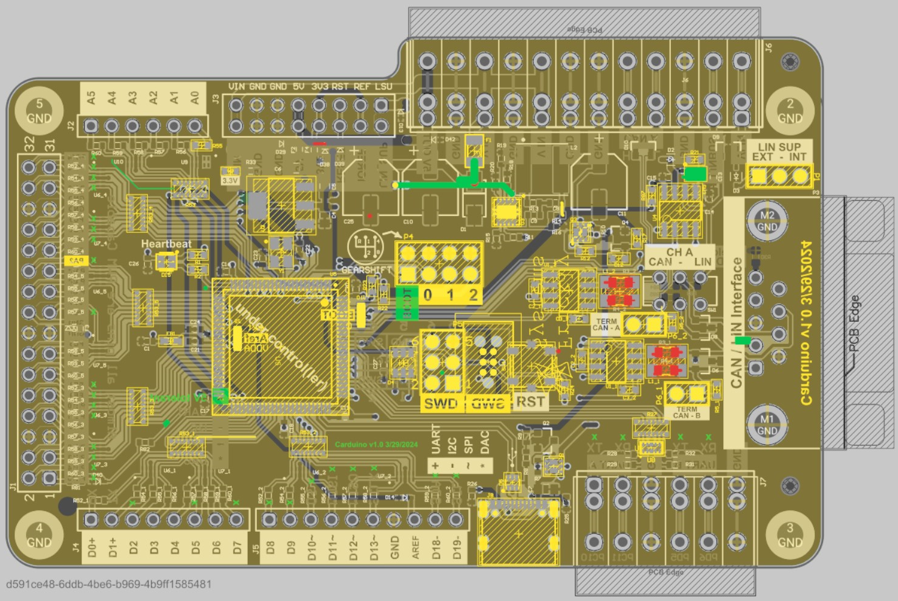

.. _board_changelog:

Changelog
###########

.. contents::
   :local:
   :depth: 2

Rev 2.1
==============

- Added an On-Board-Debugger
- Adapted the GPIO protection
- Changed the Power Multiplexing from discrete components to Ideal Diode ICs

Rev 1.1
==============

See also:

- `Schematics <https://github.com/mercedes-benz/ardep/tree/main/hardware/mainboard/mainboard_rev1/altium/ardep_board_rev_1_1_schematic.pdf>`_
- `Gerber File <https://github.com/mercedes-benz/ardep/tree/main/hardware/mainboard/mainboard_rev1/fabrication_data/ardep_board_rev_1_1_gerber.zip>`_
- `Altium Source Files <https://github.com/mercedes-benz/ardep/tree/main/hardware/mainboard/mainboard_rev1/altium/ardep_board_rev_1_1_sourcefiles.zip>`_

Rev 1.0
==============

- Silkscreen adjustments
- Remove Jumpers underneath CMM chokes to prevent short circuits
- Change VIN Routing

    Y=edit, R=removed, G=added

Rev 0.2
==============

Relevant for software development:

- Heartbeat Pinout
- CAN-Termination is no longer software configurable
- Swap PD14 and PD15 on Arduino header
- SWAP Pins along 32-pin header
- ADD Gearshift
- Change programming header pinout

Hardware:

- Combined Snapback ESD Protection
- Change input capacitors
- Change silkscreen

change the programming header position

..  figure:: rev_0_2.png
    :width: 600px

    change overview
