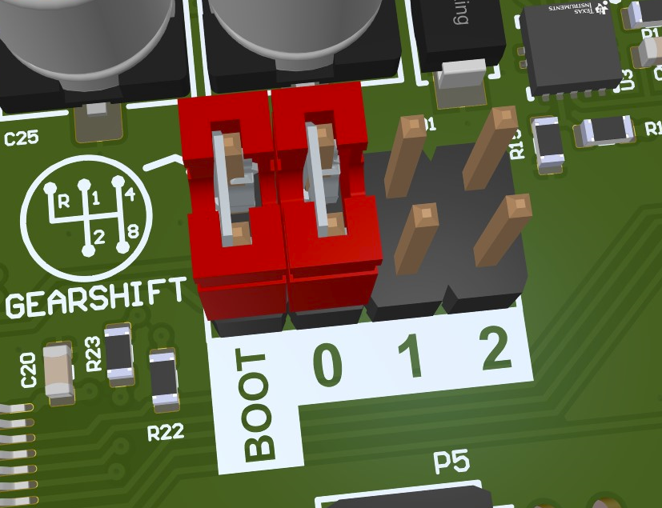

.. _gearshift:

Gearshift
#########

.. contents::
   :local:
   :depth: 2

Starting with rev0.2 the mainboard comes with a “Gearshift“ config header.
It allows the user to select different software configurations via a hardware jumper.

   
   Gear Shift Header
   
   

..  figure:: gearshift_schematic.png
   :width: 300px

   Circuit Diagram of the Gear Shift Header
   
   
The µC pins have to be configured with an internal pullup.
Placing a jumper will then pull the corresponding pin low.
Using purely software-defined pullups is possible because the state will only be evaluated after booting.
Therefore an undefined state, before initializing the IOs can be tolerated.

Pin-mapping
===========

.. list-table::
    :widths: 20 20
    :header-rows: 1
   
    *   - µC Pin
        - Position
    *   - PE4
        - Boot
    *   - PC13
        - 0
    *   - PC1
        - 1
    *   - PF1
        - 2

