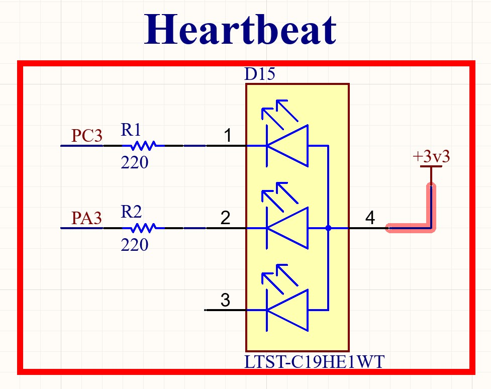

.. _heartbeat_led:

Heartbeat LED
#############

.. contents::
   :local:
   :depth: 2

The mainboard is equipped with a red/green status LED which can be used to indicate different operating states. 

   
   Heartbeat LED
   
   

   Circuit Diagram of the Heartbeat LED

Pin - mapping
=============

The status LED is configured as active-low.
It is connected to the microcontroller as indicated in the following table.

.. list-table::
    :widths: 20 20
    :header-rows: 1
   
    *   - µC Pin
        - LED Color
    *   - PC3
        - Red
    *   - PA3
        - Green
