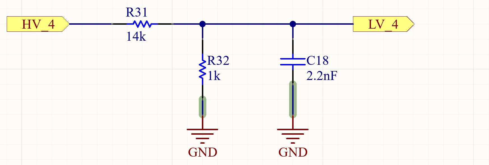
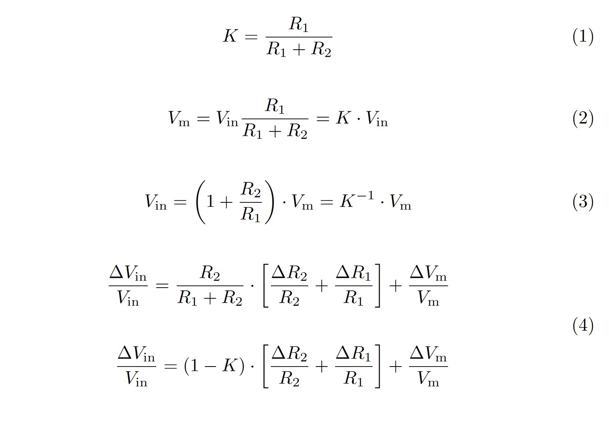
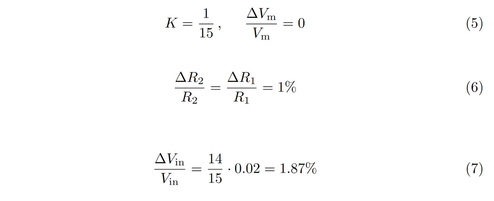
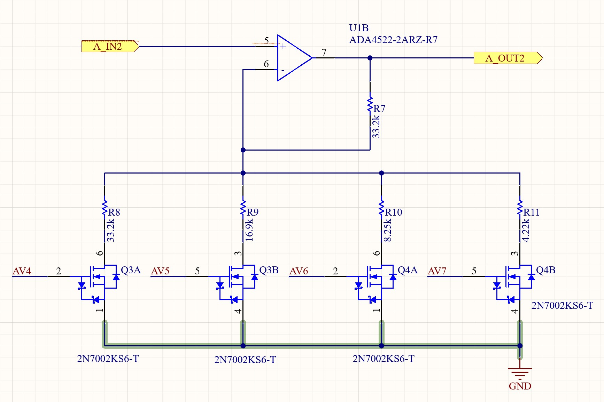

.. _hv_extension_shield_analog_io:

Analog I/O
###########

.. contents::
   :local:
   :depth: 2

Analog Input
============

To read high-voltage analog signals a 15:1 voltage divider is implemented on the shield.
It maps an input voltage of 0V - 50V down to 0 V - 3.33V.
The ADC input pins connected to those voltage dividers can also be configured as Programmable Gain Amplifier (PGA) input pins.
This allows the user to make the best use of the ADCs resolution by amplifying small input voltages by a software-defined multiplier.

Voltage Divider
---------------

In addition to being a 15:1 voltage divider.
The input structure represents a low-pass filter, with a -3dB cut-off frequency of ~70 kHz to reduce high-frequency noise on the signal lines.
The input structure has an impedance of ~15kHz at DC.

   
    Voltage divider as used on the HV-Expansion Shield

PGA
---

This Feature is Implemented in hardware, but does not yet have any software support

Error margins
-------------

The worst-case error margins have been calculated as follows:

   
    Worst-case error margin calculation

:math:`V_{in}` is the input Voltage, :math:`R_2` is the series- and :math:`R_1` is the output resistor.
:math:`V_m` is the output voltage at the ADC pin. 

Using 1% Resistors and a divider ratio of K = 1/15 results in a relative gain error of 1,87%.
This ignores possible errors of the µC ADC.

   
Using 0,5% resistors, this error can be reduced to 0,93%
   
.. _hv_extension_shield_analog_output:

Analog Output
=============

All of the digital IOs are implemented using a push-pull output driver.
It is therefore possible for any PWM-capable IO to generate a quasi-analog PWM output signal.
This signal will automatically be mapped to the voltage level connected to the corresponding IO bank.

In Addition, two analog amplifier circuits have been implemented, which allow the use of two real DACs to output an analog signal with a software-defined voltage gain.

Amplifier Circuit
-----------------

The amplifier circuit has been implemented as follows:

   
    Analog Gain Amplifier (Channel 2)

The voltage Gain can be set via the IO-Config register.
The gains have been chosen to be powers of two in order to simplify calculations in software.
The resulting truth table is shown below.
AV0..3 resemble the config bits of the first amplifier, while AV4..7 are used to configure Channel 2.

.. list-table::
    :widths: 20 20 20 20 20
    :header-rows: 1
   
    *   - AV0/4
        - AV1/5
        - AV2/6
        - AV3/7
        - Gain
    *   - 0
        - 0
        - 0
        - 0
        - 1
    *   - 0
        - 0
        - 0
        - 1
        - 2
    *   - 0
        - 0
        - 1
        - 1
        - 4
    *   - 0
        - 1
        - 1
        - 1
        - 8
    *   - 1
        - 1
        - 1
        - 1
        - 16
     

Calculating the Gain
....................

.. math::

    Gain = 1 + ( x_1 / 33.2k + x_2 / 16.9k + x_3 / 8.25k + x_4 / 4.22k) * 33.2k

:math:`x_i` are the corresponding Bits AV0…3 which can therefore take on values of zero or one.

