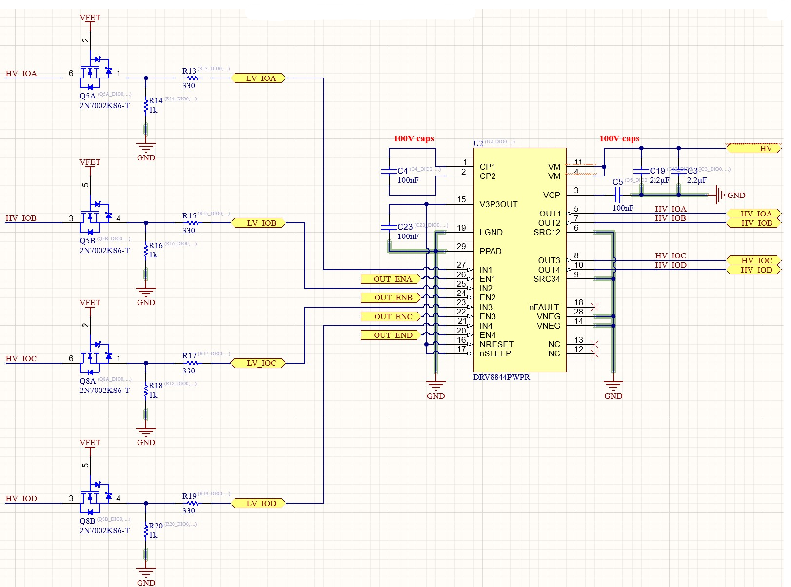
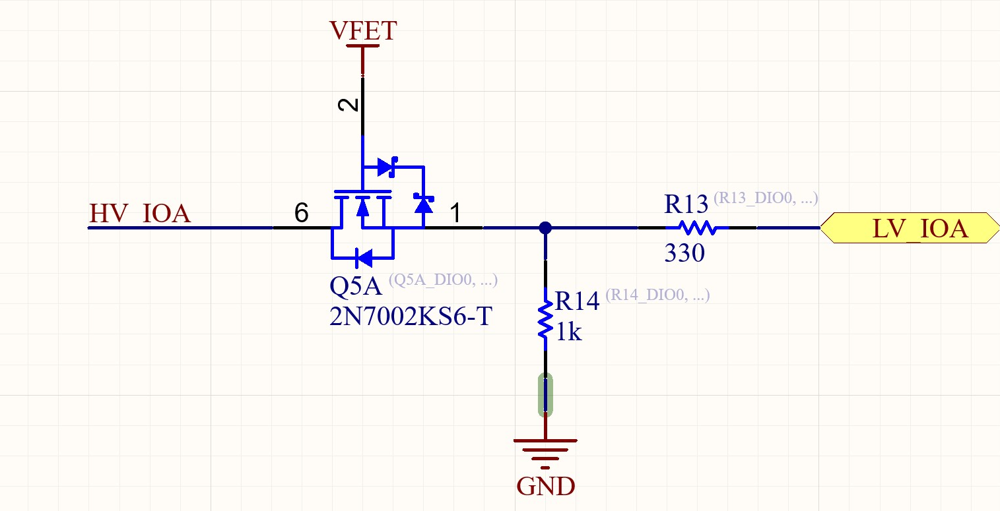

.. _hv_extension_shield_high_voltage_digital_io:

High Voltage Digital I/O
#########################

.. contents::
   :local:
   :depth: 2

The digital IOs are grouped in banks of 8-bit each.
One IO-Bank consists of two driver ICs and one of the 74HC595 Shift Registers (Data Direction Register DDR).
The High voltage supply for each IO bank can be selected individually as explained :ref:`here <hv_extension_shield_voltage_supply>`.

A MOSFET circuit is used to bring down the High voltage level, and a 60V motor driver provides the 48V capable Push-pull outputs.
The individual components are explained in :ref:`digital_input_circuit`  and :ref:`digital_output_circuit`.

The IO Interface is implemented as follows: 

   
    Schematic section of the Digital IO interface
   

Via the data direction register, the driver IC’s outputs can individually be enabled or disabled.
In a disabled state, the IO can be used as an Input. With the outputs enabled, the IO can be used as an output. 

A HIGH state at the output of the high voltage driver IC will immediately be fed back via the MOSFET input structure, basically latching the active state.
For the µC to turn the IO off again, a 330Ohm resistor has been added, which allows the µC to override this positive feedback.
For this to work, the GPIO has to be configured in Push-Pull mode.   

.. _digital_input_circuit:

Digital Input Circuit
=====================

To accept a wide range of digital input voltages, a step-down circuit has been implemented.
It consists of an N-channel MOSFET, which limits the voltage at the input pin.
Using a FET for this purpose has the benefit of lower input currents, compared to a solution involving zener diodes (~4mA at 48V) , while still enabling a wide input voltage range compared to a simple voltage divider, which would only be suitable for a specified input voltage range.

An additional advantage of this structure is that the High Level is independent of the Input voltage.
For Voltages higher than ~3V a logic High will be seen by the Microcontroller.

As the HV Input of this structure is permanently connected to the output drivers, the Input voltage must not exceed the driver's supply voltage.
Otherwise, its internal ESD protection circuit could activate, damaging the device. 

   
    Active input circuit as implemented on the HV-Shield

   
VFET is the MOSFET’s bias voltage, changing it will change the output level at the µC-Pin.
As a rule of thumb, it can be said, that the output level is ~VFET minus the MOSFET’s threshold voltage.
The generation of this bias voltage is described in more detail in :ref:`hv_extension_shield_voltage_supply`.

.. _digital_output_circuit:

Digital Output Driver
=====================

The high-voltage digital IOs are implemented using 4-channel half-bridge motor driver ICs (DRV8844).
This was found to be the most space-saving solution thus allowing the implementation of 32 48V-capable digital IOs on the High-Voltage expansion shield. 

..  figure:: output_driver.png
    :width: 600px
   
    HV-Output Driver

Each output is enabled or disabled via the IO-Config register and driven via the low-voltage GPIOs of the µC if enabled. 

Output Capabilities
********************

The minimum supply voltage of the output drivers is 8V, anything lower will trigger an undervoltage lockout state.

As the IOs are only required to deliver an output current of 15 mA, the high-current capabilities were not yet tested beyond that.
The theoretical maximum output current of the driver IC is 1.75A.
Therefore the maximum output current will be evaluated further and documented accordingly.

According to IPC 2221 voltages above 30 V require increased clearance between electrical structures.
Due to the Pin-Pitch of the output driver circuit, achieving the B2 Clearance of 0.6mm is impossible.
Using bigger packages is not an option, as it would otherwise be impossible to fit the required number of IOs onto the small form factor shield. 

As the Output drivers are fully capable of switching 48V it is certainly possible to do so for experimental purposes.
The PCB fulfills the 0.13mm clearance required for conformally coated PCBs.
This enables the option of conformally coating the PCB to comply with the IPC2221 standard.
It is recommended to do so in non-experimental applications with output Voltages surpassing 30V. 

..  figure:: ipc2221_clearances.png
    :width: 600px
   
    Clearances according to IPC2221

..  figure:: output_pin_to_pin_clearance.png
    :width: 600px
   
    The output driver’s pin to pin clearance
   
