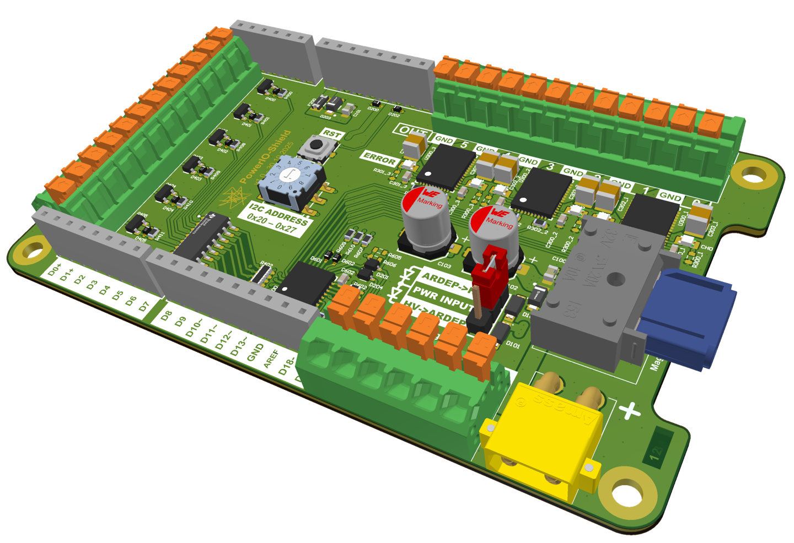
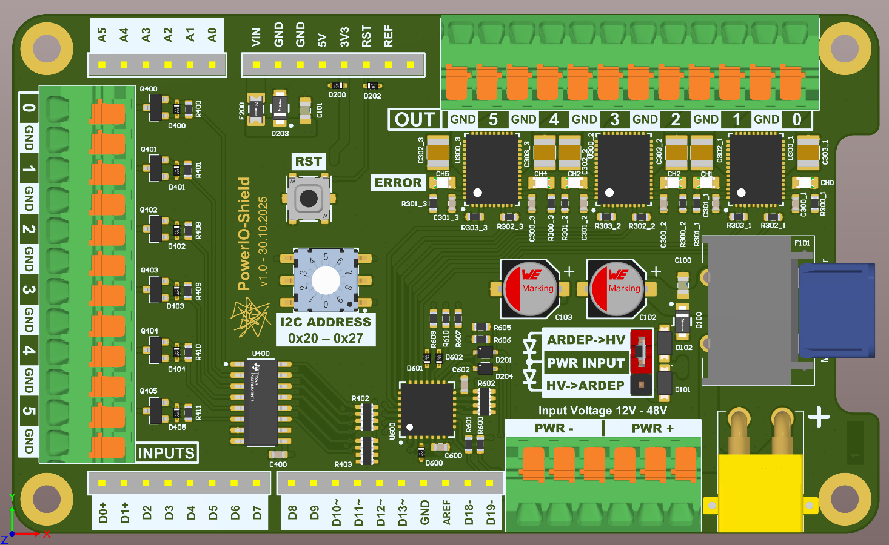
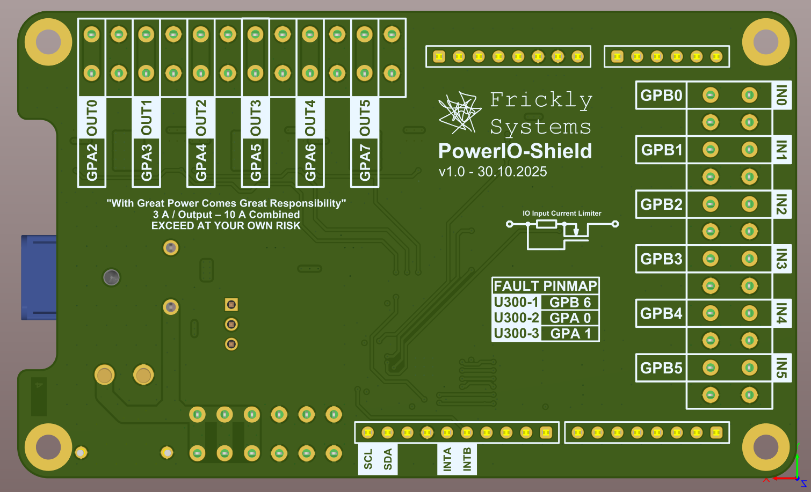

.. _power_io_shield:

ARDEP Power IO Shield
#####################

.. toctree::
   :caption: Contents:
   :maxdepth: 1
   :glob:
   
   **/*

   
The Power IO Shield extends the ARDEP platform’s power capabilities.
It is intended for switching high-power loads and being triggered by 12V+ signal levels. 

The shield offers six 48V-capable inputs and 6 high-side output drivers capable of driving 3A+ each and a total current of 10A for supply voltages of up to 48V.

   
   ARDEP Power IO Shield

   Power IO Shield Top View

   
   Power IO Shield Bottom View