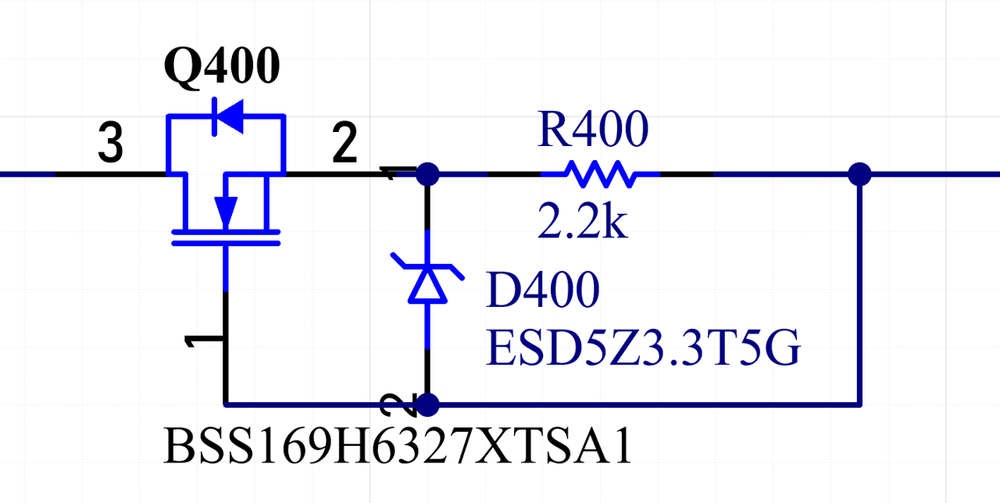

.. _power_io_shield_inputs:
   
   
.. role:: red

Power IO Inputs
################

The Power IO shield offers 6 high-voltage-capable digital inputs, which can be accessed via a spring terminal block. 

..  figure:: inputs.png
    :width: 75%
   
The input channels are implemented using a ULN2002 Darlington transistor array to provide a reasonable threshold voltage of ~10V.
In addition, a 100V depletion-mode N-channel MOSFET is used as a high-voltage current source to limit each channel’s input current to less than 2 mA, well below the ULN2002’s maximum continuous base current of 25mA.

   
The 6 input channels are connected to the :math:`I^2C` port expander as indicated in the table below.
A high voltage at an input channel pulls the respective port expander-pin low, resulting in an open-collector behaviour.

Port Expander Mapping
======================

.. list-table::
  :header-rows: 1
  :widths: 20 20

  * - IO
    - Port expander port
  * - IN 0
    - GPB 0
  * - IN 1
    - GPB 1
  * - IN 2
    - GPB 2
  * - IN 3
    - GPB 3
  * - IN 4
    - GPB 4
  * - IN 5
    - GPB 5
