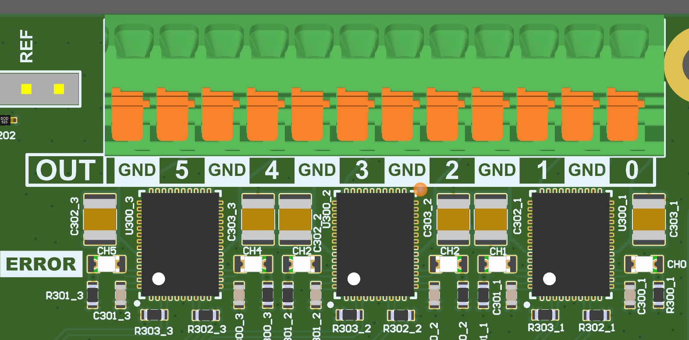
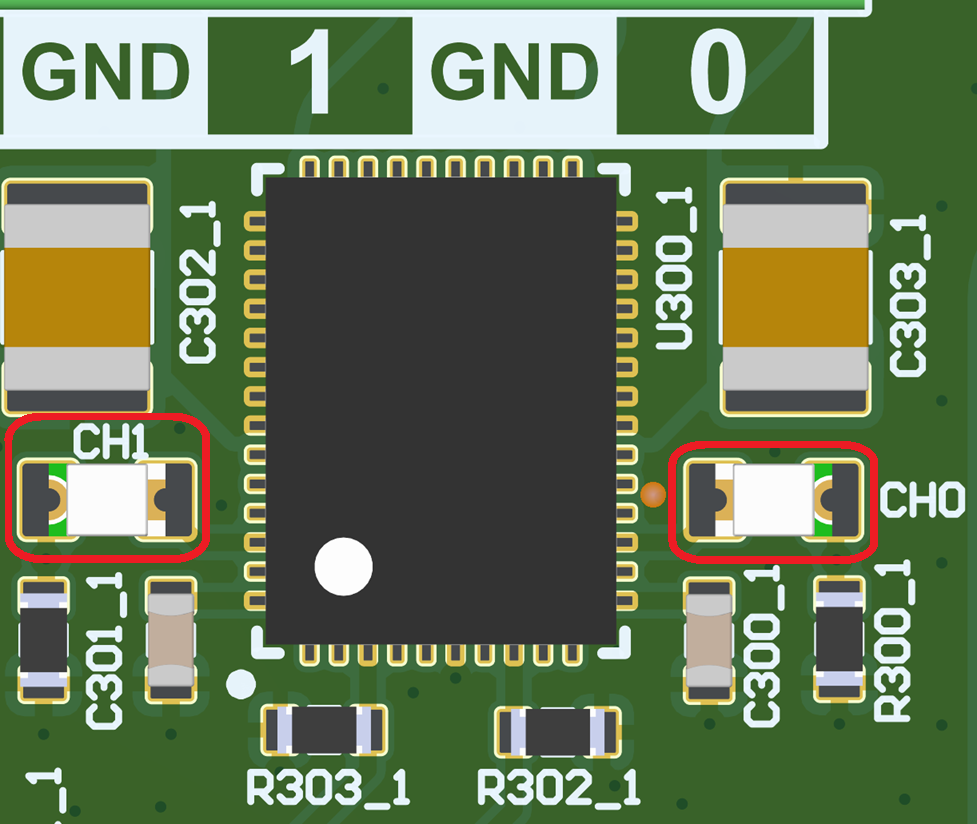

.. _power_io_shield_outputs:
   
   
.. role:: red

Power IO Outputs
################

The Power IO shield uses a direct implementation of the IPS2050HQ-32 smart highside driver to drive its 6 high voltage output channels.

   
    Power IO shield output drivers

Ratings
=======

Each output driver IC drives two of the six output channels.
The outputs have been tested for a continuous output current of 3A per channel, 6A spread across two channels of one output IC and a maximum total output current of 10A distributed evenly across all six channels. 

Exceeding these tested specifications should be done under consideration of the IPS2050HQ-32’s datasheet and at the user’s own risk.
The output driver IC itself is specified for a continuous output current of 5.6A, providing sufficient margin for the intended application.

Diagnostics
===========

The IPS2050HQ-32 smart highside switch offers a fault indicator current output for each channel, which triggers both in an overcurrent or overtemperature event.
The Power IO shield uses LEDs next to the output driver ICs to indicate whether a fault has occurred at any of the six output channels.

   
    Fault indicator LEDs for outputs 0 and 1
   
In addition, three fault signals combining both channels of each driver IC are connected to the I²C port expander.
They can be used as diagnostic feedback to the ARDEP mainboard.
This diagnostic feedback can pinpoint an error to one of the ICs, but requires manual inspection to determine which of its two channels caused the error.

Port Expander Mapping
======================

.. list-table::
  :header-rows: 1
  :widths: 40 60

  * - IO
    - Port expander port
  * - OUT 0
    - GPA 2
  * - OUT 1
    - GPA 3
  * - OUT 2
    - GPA 4
  * - OUT 3
    - GPA 5
  * - OUT 4
    - GPA 6
  * - OUT 5
    - GPA 7
  * - Fault 0 (OUT0 & OUT1)
    - GPB 6
  * - Fault 1 (OUT2 & OUT3)
    - GPA 0
  * - Fault 2 (OUT4 & OUT5)
    - GPA 1
