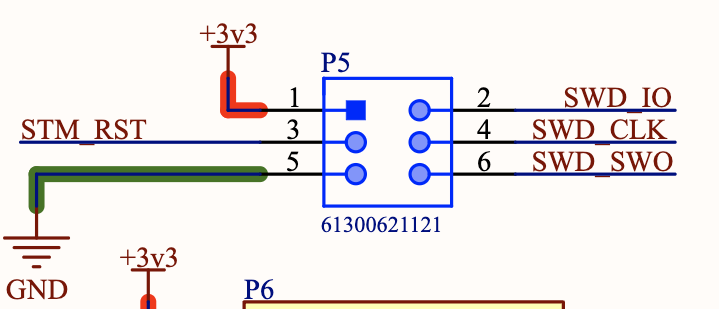

.. _debugging:

Debugging
#########

.. contents::
   :local:
   :depth: 2

Ardep v2.0.0 and later
=======================

   .. warning::

      The gdb version provided by the zephyr-sdk does not work correctly with the `Black Magic Probe <https://black-magic.org/index.html>`_.

      Therefore the ``west debug`` command will not work.
      
      Instead, use the ``gdb-multiarch`` or ``arm-none-eabi-gdb`` you installed in the :ref:`getting_started` guide.
      

   .. note::

      Depending on you system, you might have ``gdb-multiarch`` or ``arm-none-eabi-gdb`` installed. Both work the same way. Just substitute the command name accordingly.

   Ardep v2.0.0 and later come with an on-board debugger (OBD) based on the `Black Magic Probe (BMP) <https://black-magic.org/index.html>`_  project.

   This allows for easy debugging and flashing without the need for an external debug probe.
   
   For an overview of the host interface, see :ref:`on_board_debugger`.
   
   After you connected the debugger to the host via USB-C, start the debugger session with ``arm-none-eabi-gdb /path/to/build/zephyr/zephyr.elf`` and run the following instructions to correctly configure the debugger:
   
   
   .. code-block:: sh

      target extended-remote /dev/ttyACM0

      monitor auto_scan

      attach 1

   Replace ``/dev/ttyACM0`` with the correct device node for your system.
   
   A gdbinit script file is included in the root of the repository as ``debug.gdbinit``. You can use it to automate the startup process with ``arm-none-eabi-gdb -x debug.gdbinit /path/to/build/zephyr/zephyr.elf``.

   See the `BMP Guide <https://black-magic.org/usage/gdb-commands.html>`_ for more information.

      
Firmware Updates
----------------

The Black Magic Probe firmware can be updated using the dedicated ``bmputil-cli`` utility or an external programmer.

bmputil-cli
^^^^^^^^^^^

- Install the utility following the `official upgrade guide <https://black-magic.org/upgrade.html>`_.

- With the debugger connected, inspect the current firmware revision:

  .. code-block:: sh

      bmputil-cli probe info

- Upgrade to the latest release:

  .. code-block:: sh

      bmputil-cli probe update

  Select ``Black Magic Debug for BMP (ST and ST-clones targets)`` when prompted for the firmware variant and ``Flash to probe`` for the action.

- Repeat ``bmputil-cli probe info`` to confirm that the new firmware version is active.

- To flash a specific release or custom build, pass the firmware binary path to ``bmputil-cli probe update``.

Manual Update via External Debug Probe
^^^^^^^^^^^^^^^^^^^^^^^^^^^^^^^^^^^^^^

.. note::
  
  This method also supports flashing the bootloader.

A Tag-Connect footprint labeled ``DEBUGGER`` is located on the back of the board for in-circuit programming with an external debugger.
Use any SWD-compatible debugger to program the binaries at the following offsets:

  - Firmware image at ``0x08002000``

  - Bootloader image at ``0x08000000``

Obtaining Firmware Images
-------------------------

Pre-built Binaries
^^^^^^^^^^^^^^^^^^

Download the latest release from the `Black Magic Probe GitHub repository <https://github.com/blackmagic-debug/blackmagic/releases>`_.

This board requires the release named ``blackmagic-native-st-clones``.

Build from Source
^^^^^^^^^^^^^^^^^

Follow the upstream `getting started guide <https://github.com/blackmagic-debug/blackmagic/blob/main/README.md#getting-started>`_ to build the probe firmware with the following changes:

  - Configure the build with the ``stlink.ini`` cross-file
  - Add ``-Dbmd_bootloader=true`` to the build setup step to enable building of the bootloader

  .. code-block:: sh

      git clone https://github.com/blackmagic-debug/blackmagic.git
      cd blackmagic
      meson setup build --cross-file=cross-file/stlink.ini -Dbmd_bootloader=true
      meson compile -C build
      meson compile -C build boot-bin

Ardep v1.0.0
============

The following section describes how to use an on chip debugger with ardep.

Connect a debug probe
---------------------

Connect a debug probe to the SWD pins of the ARDEP board.

Pin one should only be connected to a voltage measuring pin (if required) not to power the board.

For example for an ST-Link V2 you can connect the following pins:

* SWDIO to pin 2
* SWCLK to pin 4
* GND to pin 5
* RST to pin 3

Flash using openocd
^^^^^^^^^^^^^^^^^^^

To flash the board using openocd you can use the following command:

.. code-block:: bash

   west flash --runner openocd

Debug using openocd
^^^^^^^^^^^^^^^^^^^

To debug the board using openocd you can use the following command:

.. code-block:: bash

   west debug --runner openocd

Flash and debug using JLINK
^^^^^^^^^^^^^^^^^^^^^^^^^^^

Use the sample commands as above, but replace `openocd` with `jlink`.