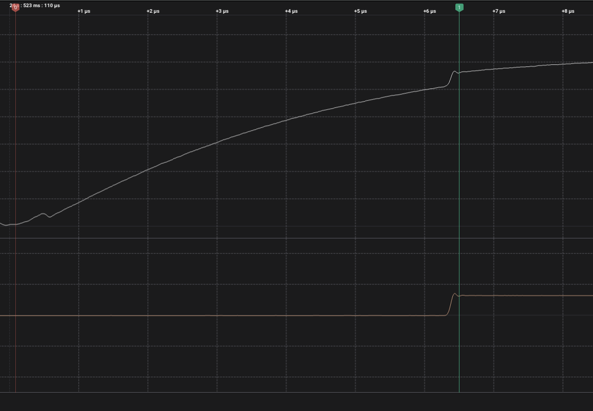

.. _digital_input_interrupt_sample:
   
Digital Input Interrupt Sample
##############################
   
This sample show the delay between an external change of the pin and the execution of the interrupt.
If an external has a rising edge, an output is set to high.

The grafic shows the delay between the external change and the execution of the interrupt.

Flash and run the example
-------------------------

The commands assume that you are in the root of the repo, not the workspace.

.. code-block:: bash

    west build --board ardep samples/digial_input_interrupt

Flash the app using dfu-util:

    .. code-block:: bash

        west ardep dfu
    